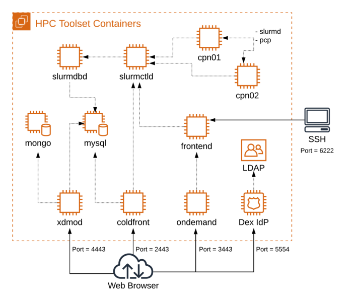

# HPC Toolset Tutorial

Tutorial for installing XDMoD, OnDemand, and ColdFront: an HPC center
management toolset.

TODO: write me

## Requirements

For this tutorial you will need to have docker installed on your local machine.

- docker
- docker-compose

## Overview

In this tutorial we present three open source projects that form a core set of
utilities commonly installed at High Performance Computing (HPC) centers. 

An overview of the containers in the cluster:



## Getting started

Start the multi-container HPC Toolset cluster using docker-compose:

```
$ docker-compose up -d
```

Note: When first building the container images, the above command can take a
bit as it will compile slurm from source and install required packages.

Once docker-compose finishes you can check the status of the containers:

```
$ docker-compose logs -f
mysql        | 200620  4:03:42 [Note] Event Scheduler: Loaded 0 events
mysql        | 200620  4:03:42 [Note] mysqld: ready for connections.
frontend     | ---> Starting the MUNGE Authentication service (munged) ...
frontend     | ---> Starting sshd on the frontend...
c1           | slurmd: Munge credential signature plugin loaded
c1           | slurmd: CPUs=1 Boards=1 Sockets=1 Cores=1 Threads=1 Memory=15575 TmpDisk=229951 Uptime=43696 CPUSpecList=(null) FeaturesAvail=(null) FeaturesActive=(null)
c2           | slurmd: debug:  AcctGatherEnergy NONE plugin loaded
coldfront    | -- Waiting for database to become active ...
coldfront    | -- Initializing coldfront database...
ondemand     | ---> Starting ondemand httpd24...
slurmdbd     | slurmdbd: debug2: DBD_NODE_STATE_UP: NODE:c1 REASON:(null) TIME:1592625828
slurmctld    | slurmctld: SchedulerParameters=default_queue_depth=100,max_rpc_cnt=0,max_sched_time=2,partition_job_depth=0,sched_max_job_start=0,sched_min_interval=2
xdmod        | 2020-06-21 19:23:48 [notice] xdmod-ingestor end (process_end_time: 2020-06-21 19:23:48)
xdmod        | ---> Starting XDMoD...
```

You can also use the helper bash script: `hpcts` to stop and start cluster:

```
./hpcts start

 Starting HPC Toolset Cluster..

Creating network "hpcts-tutorial_default" with the default driver
Creating network "hpcts-tutorial_compute" with the default driver
Creating volume "hpcts-tutorial_etc_munge" with default driver
Creating volume "hpcts-tutorial_etc_slurm" with default driver
Creating volume "hpcts-tutorial_home" with default driver
Creating volume "hpcts-tutorial_var_lib_mysql" with default driver
Creating volume "hpcts-tutorial_srv_www" with default driver
Creating hpcts-tutorial_base_1 ... done
Creating mysql                         ... done
Creating slurmdbd                      ... done
Creating slurmctld                     ... done
Creating c2                            ... done
Creating frontend                      ... done
Creating c1                            ... done
Creating ondemand                      ... done
Creating xdmod                         ... done
Creating coldfront                     ... done

 Coldfront URL: https://localhost:2443


 OnDemand URL: https://localhost:3443


 XDMoD URL: https://localhost:4443


 Login to frontend: ssh -p 6222 hpcadmin@localhost


$ ./hpcts stop
$ ./hpcts clean
```

### User Accounts

By default, all containers have local user accounts created. You can login with
to the containers via ssh, login to Coldfront and OnDemand with the same user
credentials. Default password for all accounts: ilovelinux

- hpcadmin
- cgray (password: test123)
- sfoster
- csimmons
- astewart

### Coldfront

Login to Coldfront and setup allocations.

Point your browser at the Coldfront container https://localhost:2443

You can login with user: admin password: admin

You can also login with any of the local system accounts that were created.

### OnDemand

Login to OnDemand

Point your browser at the OnDemand container https://localhost:3443

You can login with any of the local system accounts that were created. Click on
"Clusters" and then "HPC Cluster Shell Access" and you should have a login
shell on the frontend container.

### XDMoD

Login to XDMoD

Point your browser at the XDMoD container https://localhost:4443

You can login with user: admin password: admin

### Slurm

ssh into the frontend and run a job:

```
$ ssh -p 6222 cgray@127.0.0.1

[cgray@frontend ~]$ sinfo
PARTITION AVAIL  TIMELIMIT  NODES  STATE NODELIST
normal*      up 5-00:00:00      2   idle c[1-2]

[cgray@frontend ~]$ srun -N1 hostname
c1

[cgray@frontend ~]$ sbatch --wrap="uptime"
Submitted batch job 3

[cgray@frontend ~]$ ls
slurm-3.out

[cgray@frontend ~]$ cat slurm-3.out
 04:11:15 up 12:15,  0 users,  load average: 0.03, 0.29, 0.37

# Test you can ssh into the first compute node from the frontend.
[cgray@frontend ~]$ ssh c1

[cgray@c1 ~]$ ls
slurm-3.out
```

### Finding IP address of container

```
$ docker inspect -f '{{range .NetworkSettings.Networks}}{{.IPAddress}}{{end}}' coldfront
172.27.0.10
```

## Shutting down

To tear down all contianers and remove volumes:

```
$ docker-compose stop
$ docker-compose rm -f
$ docker-compose down -v
```

## Acknowledgments

The multi-container Slurm cluster using docker-compose is loosely based on the
following:

- https://github.com/giovtorres/slurm-docker-cluster
- https://github.com/OSC/ood-images/tree/master/docker-with-slurm

## License

This tutorial is released under the GPLv3 license. See the LICENSE file.
